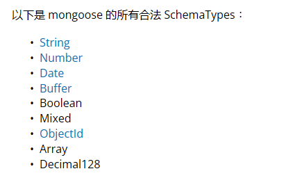
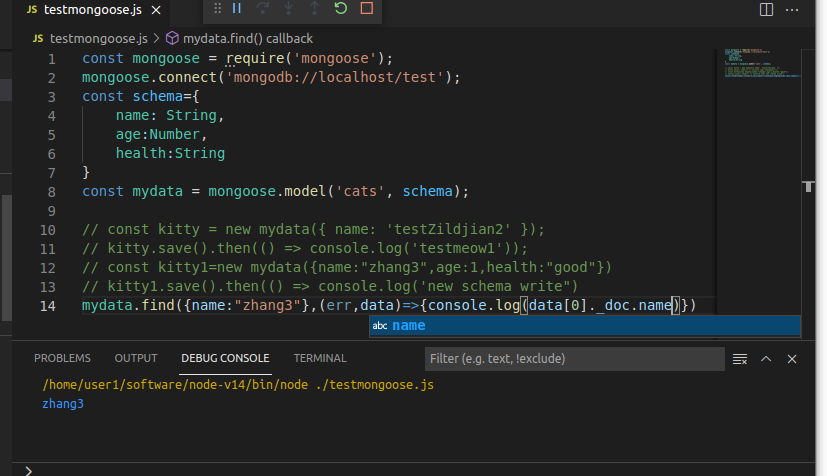

# mongoose使用

## 1.安装

创建node.js项目后，安装mongoose : npm install mongoose

要求已经安装并打开mongodb服务器

## 2.使用流程

1)弓|入mongoose :
const mongoose = require('mongoose');
2)连接数据库:
mongoose.connect('mongodb://localhost/test');

其中test是数据库名。
3)创建一个schema：

const schema={

​    name: String,

​    age:Number,

​    health:String

}

创建的schema只有在创建moddel时引用才可以作用：mongoose.model('Cat',schema)。

mongoose有自己的基本数据类型：

创建的schema生效后，存储到数据库的数据必须遵守，否则不能存储，但系统没有原生的错误提示，只是存储一个空数据

4)创建一个model:

const Cat = mongoose.model('Cat', schema);

5)写入数据库：

kitty1.save()

写入数据集的名称：是定义model的第一个参数，并进行了修改：保证是英文的复数形式（自动在最后加s,如果没有的话）,不区分大小写，全部用小写字母。

6)数据查找

model名.find({查询条件}，callback(err,查询结果)=>{})

查询结果是一个人Array，data[0]._doc是查询出的文档

